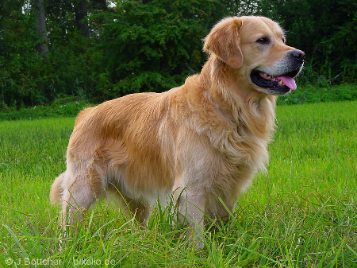

.. _readme:

Fetches event data from DalmatinerDB. Currently works with syslog format logs sent into DalmatinerDB via
the proxy.

`Usage`_
----------------------------

Golden Retriever has built in help. Just type `gr` after installation. To search log file simply type `gr search`
or alternatively you can start to filter log messages based on regular expressions.

.. code-block:: none

    $ gr search 'severity == info AND body ~= root'
    2016-09-24 19:39:35 gcenagiosn0 info authpriv pam_unix(cron:session):session closed for user root
    2016-09-24 19:40:01 gcenagiosn0 info authpriv pam_unix(cron:session):session opened for user root by (uid=0)
    2016-09-24 19:40:01 gcenagiosn0 info clock (root) CMD (/usr/bin/newman -c /dataloop/app/misc/postman/dataloop_internal_api.json -e /dataloop/app/misc/postman/env/prod.json -C -o /tmp/dataloop_prod_api.json)
    2016-09-24 19:41:32 gcenagiosn0 info authpriv pam_unix(cron:session):session closed for user root
    2016-09-24 19:42:01 gcenagiosn0 info clock (root) CMD (/usr/bin/newman -c /dataloop/app/misc/postman/dataloop_internal_api.json -e /dataloop/app/misc/postman/env/prod.json -C -o /tmp/dataloop_prod_api.json)

`Future`_
----------------------------

Enabling colours
Live tail
Better search functionality and more options

`Installation`_
----------------------------

install golden-retriever using pip

.. code-block:: none

    pip install --upgrade golden-retriever

set the url in  ~/.golden-retriever.yaml to match the DalmatinerDB front end address and port

.. code-block:: none

    ---
    url: http://localhost:8080
